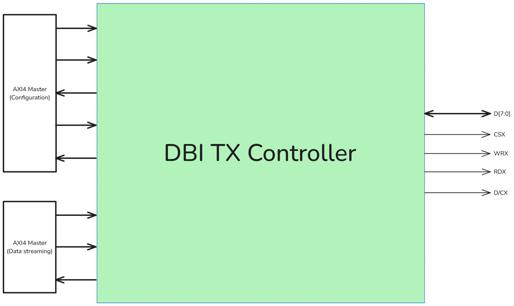

# DBI TX Controller

*Design note of DBI TX Controller*

# 1. Specification

## 1.1. Introduction

The DBI TX Controller is a module used for communicating between the on-chip system and external display component via the MIPI DBI protocol. The controller is divided into 2 layers:

- **Physical layer**: using the MIPI DBI Type-A interface to stream pixels from the system to a display component.
- **Application layer**: using the 2 AXI4 Interfaces to communicate with the on-chip system for data streaming and configuration purposes.

The controller can be configured via 2 methods:

- **Hard-configuration:** the user can configure via parameters of RTL code (for the decoded address of the IP, etc.)
- **Soft-configuration**: the user can configure via the AXI4 interface (for some commands of DBI protocol, etc.)

### 1.2. Interface

*The DVP RX Controller has 3 main interfaces: MIPI DBI interface and 2 AXI4 (Slave) interface.*

### 1.3. Block diagram

# 2. Description

The MIPI DBI protocol has 2 main types of transmission:

- Configuration transmission
- Data streaming transmission

For the configuration transmission, the TX will send 1 command and 1 (or more) parameter(s) to configure the display component, such as soft reset, start-column line, end-column line, start-row line, end-row line and display ON.

For the data streaming transmission, the TX will send 1 command (write memory option) and 1 (or more) data to stream video on the display screen.

Therefore, this controller has **6 main states**:

- **IDLE state**: the controller is waiting for the start signal from the master
- **HW_RST state**: the TX will reset the display component via RSX pin of the DBI interface
- **SET_COL state**: the TX will send 1 command and 4 parameters to configure the start-column line and the end-column line
- **SET_ROW state**: the TX will send 1 command and 4 parameters to configure the start-row line and the end-row line.
- **SET_DISP state**: the TX will send 1 command to turn on the screen
- **PIXEL_STREAMING state**: the TX will send 1 command and 1 (or more) data to stream the pixel on the display screen.

# 3. DBI TX controller configuration

The DBI TX controller used 1 AXI4 interface for configuration purposes. Some configuration options that the user can configure include:

- Command function in the DBI protocol
- Parameter for each command function in the DBI protocol

There are **14 configuration registers** in the DBI TX controller:

| Register’s name | Bit’s index | Description | Address |
| --- | --- | --- | --- |
| `DBI_TX_STATUS_REG` | 0 | Start signal for the DBI streaming | `*0x3000_0000*` |
|  | 1-7 | Reserved |  |
| `DBI_ADDR_SOFT_RST_REG` | 0-7 | The command function of soft reset | `*0x3000_0001*` |
| `DBI_ADDR_DISP_ON_REG` | 0-7 | The command function of display ON | `*0x3000_0002*` |
| `DBI_ADDR_SET_COL_REG` | 0-7 | The command function of setting column line | `*0x3000_0003*` |
| `DBI_ADDR_SET_ROW_REG` | 0-7 | The command function of setting row line | `*0x3000_0004*` |
| `DBI_ADDR_SET_PIXEL_REG` | 0-7 | The command function of streaming pixel | `*0x3000_0005*` |
| `DBI_CMD_START_COLUMN_H_REG` | 0-7 | The command parameter of the start-column line (Bit 15:8) | `*0x3000_0006*` |
| `DBI_CMD_START_COLUMN_L_REG` | 0-7 | The command parameter of the start-column line (Bit 7:0) | `*0x3000_0007*` |
| `DBI_CMD_END_COLUMN_H_REG` | 0-7 | The command parameter of the end-column line (Bit 15:8) | `*0x3000_0008*` |
| `DBI_CMD_END_COLUMN_L_REG` | 0-7 | The command parameter of the end-column line (Bit 7:0) | `*0x3000_0009*` |
| `DBI_CMD_START_ROW_H_REG` | 0-7 | The command parameter of the start-row line (Bit 15:8) | `*0x3000_000A*` |
| `DBI_CMD_START_ROW_L_REG` | 0-7 | The command parameter of the start-row line (Bit 7:0) | `*0x3000_000B*` |
| `DBI_CMD_END_ROW_H_REG` | 0-7 | The command parameter of the end-row line (Bit 15:8) | `*0x3000_000C*` |
| `DBI_CMD_END_ROW_L_REG` | 0-7 | The command parameter of the end-row line (Bit 7:0) | `*0x3000_000D*` |

# 4. DBI TX controller behavior

## 4.1. Configuration behavior

The DBI TX controller uses the AXI4 interface for soft configuration, the AXI4 interface supports 1 outstanding single-burst transaction.

- Configuration transaction example

**Warning**: The DBI transmission starts immediately after the start signal (`DBI_TX_STATUS_REG`) is set to `1`. Therefore, you should set up other configuration registers before asserting the `DBI_TX_STATUS_REG` register. This is an example:

## 4.2. Controller behavior

- **Hardware reset state**: after the hardware reset is completed, the TX must wait **120ms** for the display component to reset all parameters.
    
    
    

- **Pixel streaming states**: The controller will stream pixel to display component until the `DBI_TX_STATUS_REG[0]` is de-assert (set to `0`), at which point it will return to the HW_RST state.
    
    
    

## 5. MIPI DBI protocol

*More detail in*: 

1. MIPI DBI v2 specification: [https://drive.google.com/file/d/1iDsAjChX2L79teyt8PDpjys5zcPX3LMd/view?usp=sharing](https://drive.google.com/file/d/1iDsAjChX2L79teyt8PDpjys5zcPX3LMd/view?usp=sharing)
2. ILI9486 datasheet: for the DC/AC characteristic timing [https://drive.google.com/file/d/123y4W147dIzveNxKNNUkk35IAN8Ewpkb/view?usp=sharing](https://drive.google.com/file/d/123y4W147dIzveNxKNNUkk35IAN8Ewpkb/view?usp=sharing)